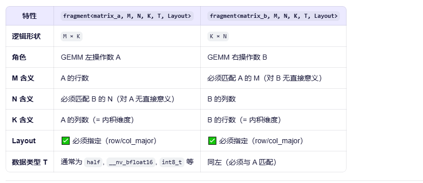
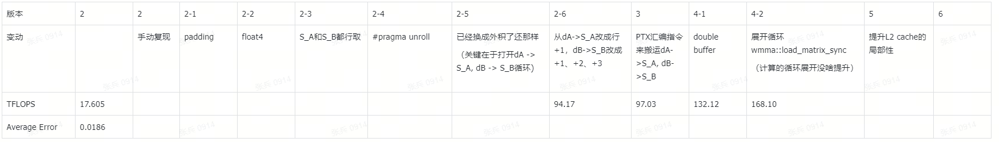

# 不懂的地方

## 乘法左矩阵的行优先和列优先，右矩阵的行优先和列优先

## 行优先和列优先对取数和存数有啥影响，到底是取数地址连续还是放数地址连续

WMMA 只关心：
逻辑矩阵尺寸：A 是 M×K，B 是 K×N
内维度匹配：A_frag.k == B_frag.k
layout 正确描述内存布局：确保 load_matrix_sync 能正确读取数据
至于 A 是行优先还是列优先，B 是行优先还是列优先，WMMA 完全不关心，只要你告诉它正确的 layout 和 LDA。

MMA位于更底层一些

学习链接：

https://zhuanlan.zhihu.com/p/555339335

https://ayyha.github.io/2024/08/08/tensor-core%E5%AD%A6%E4%B9%A0/

https://zhuanlan.zhihu.com/p/631227862

https://zhuanlan.zhihu.com/p/20579515046

https://www.cnblogs.com/zhaoweiwei/p/19058528/NsightCompute

常用命令：
nvcc -o v0 v0.cu -gencode=arch=compute_80,code=sm_80 #不声明架构有warning
./task1.sh run --float f16 --ver 12

ncu --export log/v4-2.ncu-rep ./v4-2

1. global memory -> shared memory 搬运方法的异同
2. 循环展开的原因
3. 编译命令的问题
4. 为什么会出现基本逻辑相同反而快于参照代码，仔细观察发现，快的代码没有#pragma unroll 32的优化空间，且如果在最后添加split_k_id = K / BK优化会消失，所以应该是编译器端的优化

# 参考
## [博客](https://www.zhihu.com/question/41060378/answer/2645323107)
## 参考代码
(https://github.com/nicolaswilde/cuda-tensorcore-hgemm/blob/master/gemm-tc-f16f16-128x256-public/gemm.cu)
(https://github.com/siboehm/SGEMM_CUDA?tab=readme-ov-file)
## 总览
